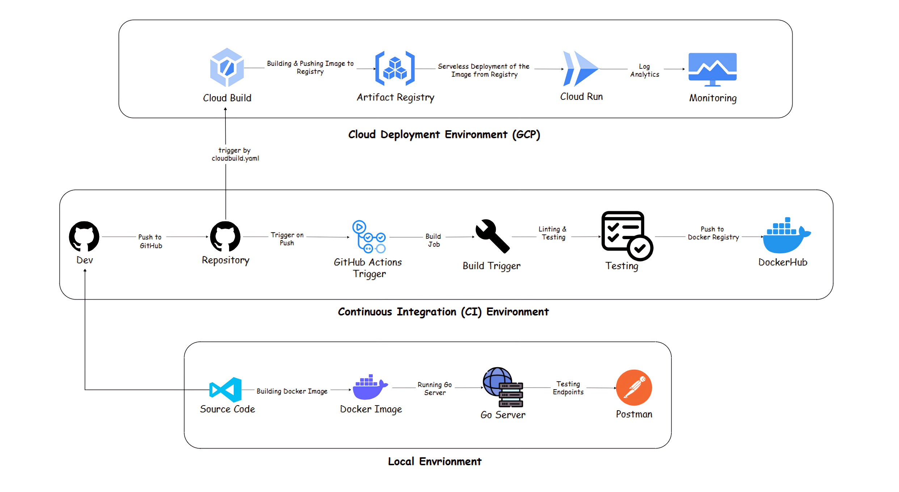
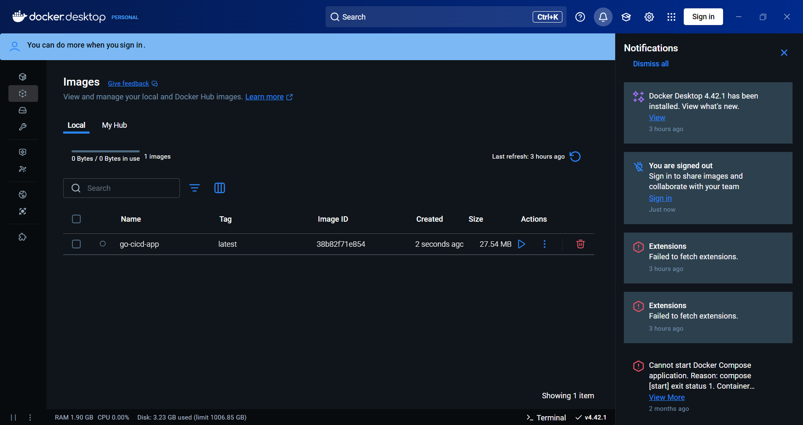
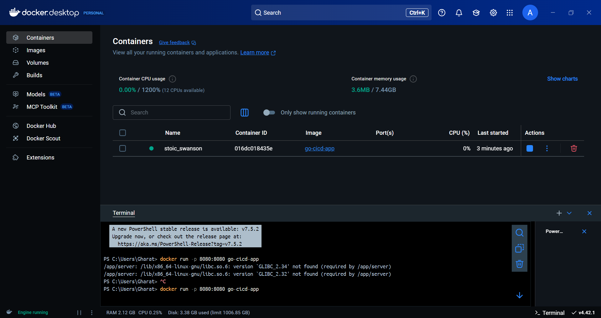
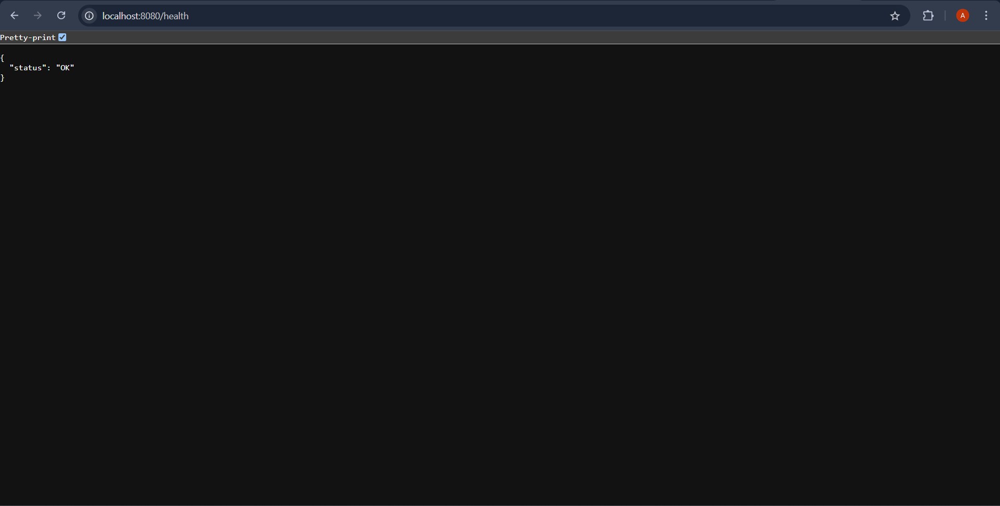
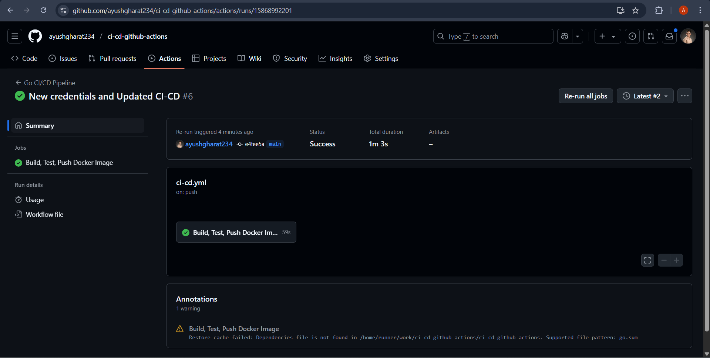
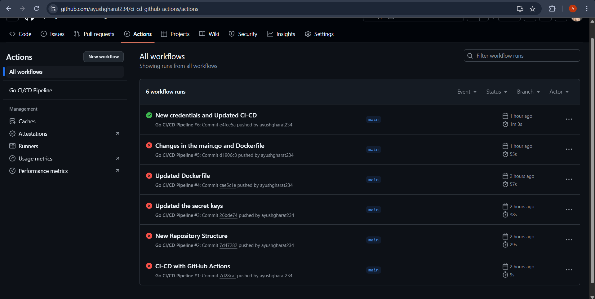
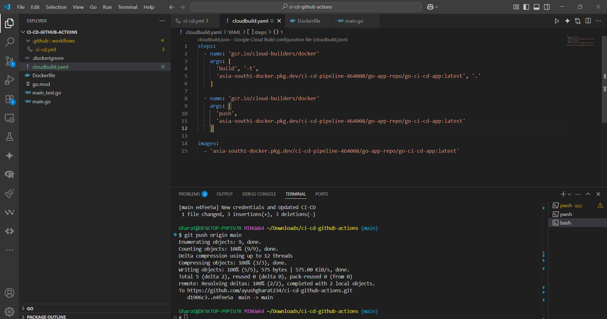
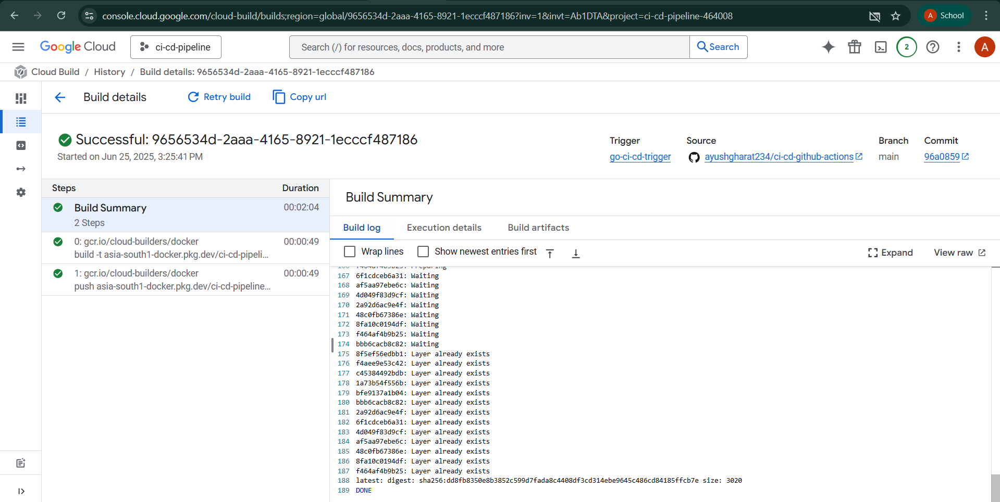
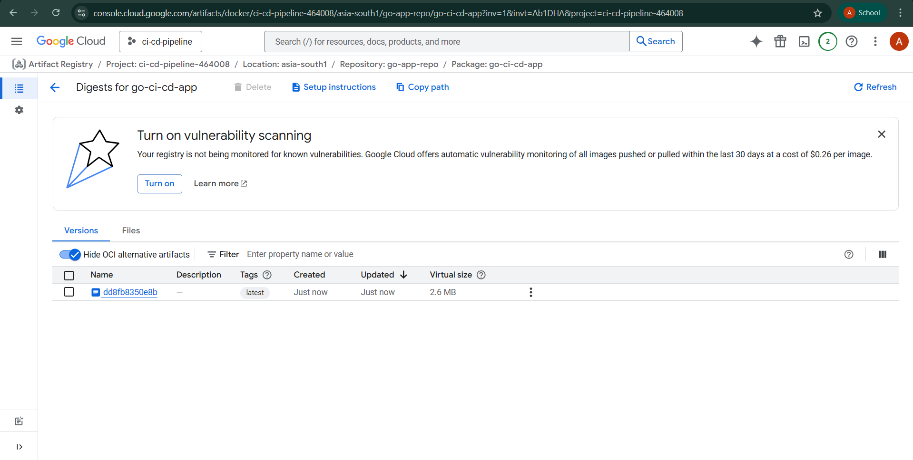
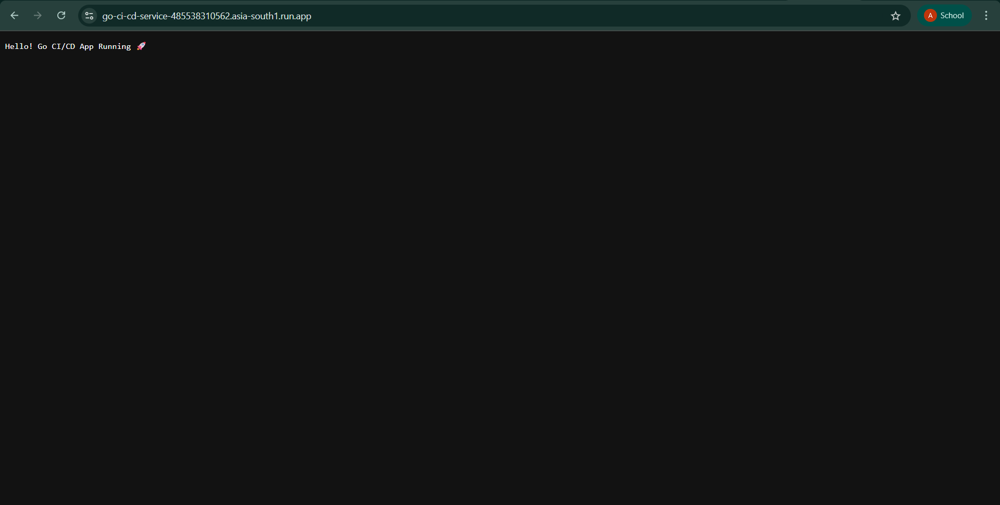

# Go CI/CD Pipeline with GitHub Actions & Google Cloud Build

A production-ready example of a **Go web application** with a fully automated **CI/CD pipeline** using **GitHub Actions** and **Google Cloud Build**. This project demonstrates how to build, test, containerize, and deploy a Go app to Google Cloud, leveraging best practices for modern DevOps workflows.

---

## 🚀 Project Overview

This repository contains a simple Go web server with a `/health` endpoint and a root endpoint. The project is designed to showcase:

- Automated testing and Docker image builds via GitHub Actions.
- Secure image storage in Google Artifact Registry.
- Deployment automation using Google Cloud Build and (optionally) Cloud Run.
- Infrastructure-as-Code for reproducible CI/CD pipelines.

---

## 🏗️ Architecture

> 

- **Source Code**: GitHub
- **CI/CD**: GitHub Actions (build, test, Dockerize, push)
- **Container Registry**: Google Artifact Registry
- **Build & Deploy**: Google Cloud Build
- **Deployment**: Google Cloud Run

---

## 📂 Project Structure

```
.
├── main.go                # Go web server source code
├── main_test.go           # Unit tests for the server
├── Dockerfile             # Multi-stage Docker build
├── cloudbuild.yaml        # Google Cloud Build pipeline
├── .github/workflows/     # GitHub Actions workflow
├── architecture/          # Architecture diagram here
└── screenshots/           # Screenshots here
```

---

## ⚙️ How It Works

### 1. **Go Application**

- **Endpoints:**
  - `/` — Returns a welcome message.
  - `/health` — Returns a JSON health status.

### 2. **Testing**

- Unit tests are defined in `main_test.go` and run automatically in CI.

### 3. **Containerization**

- Multi-stage Docker build for minimal, secure images.
- Uses `golang:1.21` for build, `gcr.io/distroless/static` for runtime.

### 4. **CI/CD Pipeline**

#### **GitHub Actions Workflow**

- Triggers on push or PR to `main`.
- Steps:
  1. Checkout code
  2. Set up Go environment
  3. Run unit tests
  4. Build and push Docker image to DockerHub (can be adapted for Artifact Registry)

#### **Google Cloud Build**

- Defined in `cloudbuild.yaml`.
- Builds and pushes the Docker image to Artifact Registry.
- Stores logs in a GCS bucket.

---

## ☁️ GCP Setup & Commands

Below is a complete list of all `gcloud` CLI commands used to set up Artifact Registry, Cloud Build, and IAM for this project.

<details>
<summary>Click to expand GCP setup commands</summary>

### 1. Enable Required APIs

```bash
gcloud services enable \
    artifactregistry.googleapis.com \
    cloudbuild.googleapis.com \
    iam.googleapis.com
```

### 2. Create Artifact Registry (Docker) Repository

```bash
gcloud artifacts repositories create go-app-repo \
    --repository-format=docker \
    --location=asia-south1 \
    --description="Go CI/CD App Container Repository"
```

### 3. Create IAM Service Account for GitHub CI/CD

```bash
gcloud iam service-accounts create github-cicd-bot \
    --description="Service Account for GitHub Actions to push Docker images" \
    --display-name="GitHub CI/CD Bot"
```

### 4. Grant Required IAM Roles

```bash
gcloud projects add-iam-policy-binding YOUR_PROJECT_ID \
    --member="serviceAccount:github-cicd-bot@YOUR_PROJECT_ID.iam.gserviceaccount.com" \
    --role="roles/artifactregistry.writer"

gcloud projects add-iam-policy-binding YOUR_PROJECT_ID \
    --member="serviceAccount:github-cicd-bot@YOUR_PROJECT_ID.iam.gserviceaccount.com" \
    --role="roles/cloudbuild.builds.editor"
```

### 5. Generate JSON Key for GitHub Integration

```bash
gcloud iam service-accounts keys create key.json \
    --iam-account=github-cicd-bot@YOUR_PROJECT_ID.iam.gserviceaccount.com
```
> Upload `key.json` to GitHub Secrets as `GCP_SA_KEY`.

### 6. Trigger Manual Cloud Build (Optional)

```bash
gcloud builds submit --region=asia-south1 \
    --tag=asia-south1-docker.pkg.dev/YOUR_PROJECT_ID/go-app-repo/go-ci-cd-app:latest
```

### 7. (Optional) Set Default Project + Region

```bash
gcloud config set project YOUR_PROJECT_ID
gcloud config set builds/region asia-south1
```

### 8. (Optional) Deploy to Cloud Run

```bash
gcloud run deploy go-ci-cd-app \
    --image=asia-south1-docker.pkg.dev/YOUR_PROJECT_ID/go-app-repo/go-ci-cd-app:latest \
    --region=asia-south1 \
    --platform=managed \
    --allow-unauthenticated
```

</details>

---

## 📦 Artifacts and Deployment Targets

- **Docker Image:**  
  `asia-south1-docker.pkg.dev/YOUR_PROJECT_ID/go-app-repo/go-ci-cd-app:latest`
- **(Optional) Cloud Run Service:**  
  `go-ci-cd-app` in region `asia-south1`

---

## 📖 Project Walkthrough

This section provides a visual, step-by-step walkthrough of the entire CI/CD pipeline and deployment process, illustrating how the Go application moves from source code to a live, cloud-hosted service. Each stage is accompanied by real screenshots from the project.

### 1. Building the Docker Image Locally

Development begins with building the Docker image for the Go application on your local machine. This ensures the application runs as expected in a containerized environment before pushing to the cloud.



---

### 2. Running and Testing the Container Locally

After building the image, the container is run locally to verify that the application starts correctly and serves requests as intended.



You can see the server running and accessible on the specified port:


A health check endpoint (`/health`) is also tested to confirm the application is healthy:



---

### 3. Continuous Integration with GitHub Actions

The project uses GitHub Actions to automate testing, building, and pushing Docker images. Every push or pull request to the `main` branch triggers the CI pipeline:

- Code is checked out
- Go environment is set up
- Unit tests are executed
- Docker image is built and pushed

Successful execution of the workflow is shown below:



You can also track the history and iterations of builds:



---

### 4. Cloud Build Pipeline on Google Cloud Platform

The `cloudbuild.yaml` file defines the steps for Google Cloud Build to build and push the Docker image to Artifact Registry. The configuration is managed directly in GCP:



Cloud Build triggers can be monitored, and detailed logs are available for each build:



---

### 5. Artifact Registry: Storing Docker Images

Once built, the Docker image is pushed to Google Artifact Registry, providing a secure and scalable storage solution for container images:



---

### 6. Deployment to Cloud Run

The final step is deploying the containerized application to Google Cloud Run, enabling serverless, scalable hosting of the Go app. The deployment endpoint and status are shown below:



---

This visual walkthrough demonstrates the complete journey of your Go application, from local development and testing, through automated CI/CD, to secure, scalable deployment on Google Cloud Platform. Each screenshot provides evidence of the process and the robustness of the pipeline, making it easy for reviewers, recruiters, and collaborators to understand the technical depth and practical implementation of this project.

---

## 🗂️ GCP Resources Created

| Resource Type           | Name               | Region        |
| ----------------------- | ------------------ | ------------- |
| Artifact Registry       | `go-app-repo`      | `asia-south1` |
| IAM Service Account     | `github-cicd-bot`  | —             |
| Docker Image Repository | `go-ci-cd-app`     | `asia-south1` |
| GitHub Build Trigger    | `go-ci-cd-trigger` | `asia-south1` |

---

## 🚀 Future Enhancements

Here are some practical and easily integratable improvements you can consider for this project:

- **Automated Deployment to Cloud Run:**
  - Integrate Cloud Run deployment directly into the Cloud Build pipeline for true end-to-end automation.

- **Slack/Email Notifications:**
  - Add notifications for build and deployment status using Slack or email integrations in GitHub Actions or Cloud Build.

- **Branch-based Environments:**
  - Set up preview/staging environments for feature branches using separate Cloud Run services or tags.

- **Secret Management:**
  - Use Google Secret Manager or GitHub Secrets for managing sensitive environment variables and credentials.

- **Code Quality & Security Scans:**
  - Integrate tools like GoLint, GoSec, or SonarCloud into the CI pipeline for static code analysis and security checks.

- **Automated Rollbacks:**
  - Implement rollback strategies in Cloud Run or Cloud Build to revert to the previous version on failed deployments.

- **API Monitoring & Alerting:**
  - Set up Google Cloud Monitoring and Alerting for uptime, latency, and error rate tracking.

- **Infrastructure as Code:**
  - Use Terraform or Google Cloud Deployment Manager to manage GCP resources as code for reproducibility.

- **Performance Testing:**
  - Add load testing (e.g., with k6 or Locust) as a CI step to ensure the app performs well under stress.

- **Multi-region Deployment:**
  - Deploy the application to multiple regions for higher availability and lower latency.

These enhancements can help make your CI/CD pipeline and deployment process even more robust, secure, and production-ready.
